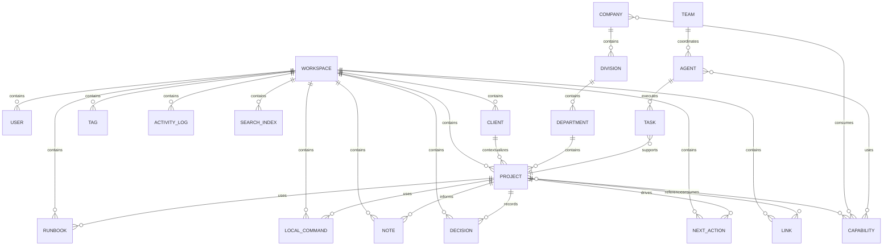
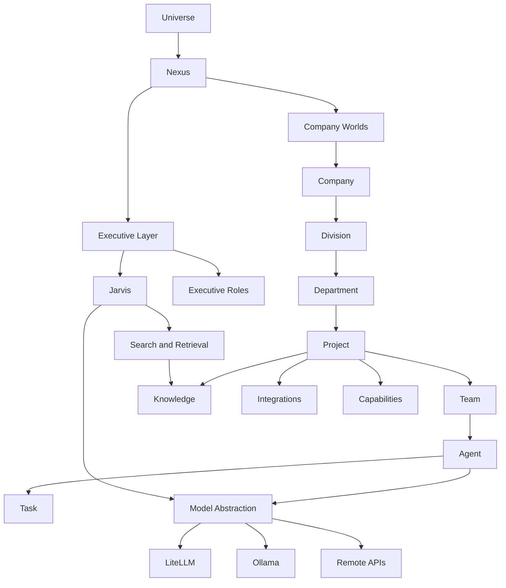
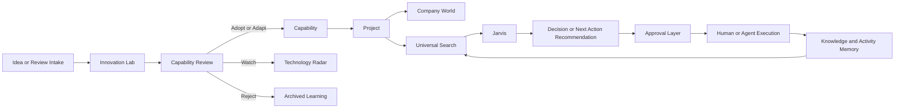

# Domain Relationships

## Purpose

This document formalizes the key domain relationships across CommandCore and provides canonical diagrams for Sprint 1 and future architecture.

## Responsibilities

- Show how the primary domain entities connect.
- Distinguish current operational substrate from future enterprise structure.
- Provide a diagrammatic reference for shared architectural understanding.

## Ownership

This relationship model is owned by CommandCore architecture and derived from the locked Constitution, Master Blueprint, and MVP PRD.

## Lifecycle

1. Sprint 1 relationships are centered on workspace-scoped operational records.
2. Future relationships expand upward into companies, capabilities, agents, tasks, and executive coordination.
3. Knowledge, search, and activity remain connective tissue across both stages.

## Relationships

### Mermaid ER Diagram

### Mermaid Architecture Diagram

### Mermaid Flow Diagram

## Future Extensions

- More detailed company-world decomposition
- Capability dependency networks
- Agent collaboration diagrams
- Knowledge graph-specific relationship views
- Infrastructure service topology diagrams

## Examples

Example 1:
- A project links runbooks, decisions, and next actions inside a workspace today, while remaining future-compatible with company attachment.

Example 2:
- A capability discovered in Innovation Lab is reviewed, promoted, then consumed by a project inside a company world.

## Rules

- Workspace scope is the Sprint 1 baseline.
- Company hierarchy is the future operating direction.
- Capabilities remain cross-project reusable assets.
- Executive coordination must stay above company, project, and agent layers.
- Diagrams describe domain relationships, not implementation APIs.
